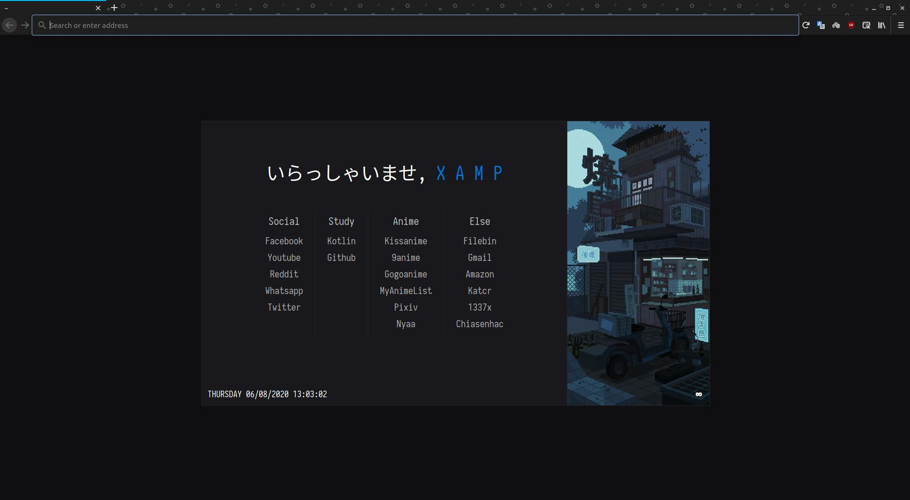

Startpage
========
#### AlbonyCal

This is a personal project & it's not fully polished and perfect.. I'm not a webdev
I use this as my FireFox homepage using [NewTabOveride](https://addons.mozilla.org/en-US/firefox/addon/new-tab-override/)
Plugin.

### Live Demo: <a href="http://albonycal.github.io/startpage/">Demo</a>

### Default Home

This is a fork of RamenMaestro's [startpage](https://github.com/RamenMaestro/startpage) with a image scroll option and larger option size.
## Font
This project uses the Iosevka font

## Credits
Images used in the sidebar are by background artist [Waneella](https://twitter.com/waneella_).
